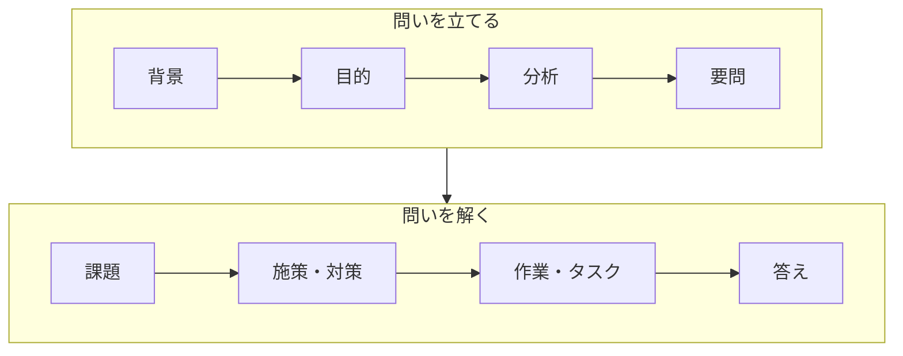

# yomons（要問）

## なぜ `issues` じゃないか

GitHub には `Issues` 機能があるため、フォルダ名として使うと紛らわしい。  
そこで日本語「要問（ようもん）」をローマ字にした `yomons` にした。

---

## 要問（Issue）とは

**「答えを出す価値のある本質的な問い」= 「要となる問い」**

4つの要素に分解するとこうなる。

| 要素 | 定義 |
|------|------|
| 答えを出す | 回答可能であり |
| 価値のある | 答えが出ると良い影響が大きい |
| 本質的な | ものごとの根幹に迫る |
| 問い | 疑問文 |

---

## 要問フレームワーク：全フェーズの定義

**要問**は単独では機能しない。前後のフェーズと組み合わせて初めて威力を発揮する。  
これが全フローだ。

各フェーズの定義を日英で整理するとこうなる。

| # | 日本語 | English | 文型 | 定義 | Definition |
|---|--------|---------|------|------|------------|
| 1 | 背景 | Background | 自由 | 置かれている状況 | The current situation or context |
| 2 | 目的 | Purpose | 動詞句 | 何のために取り組むかの宣言 | A declaration of why we are addressing this |
| 3 | 分析 | Analysis | 自由 | 要問を導くための観察・整理・比較・推測など | Observation, organization, comparison, inference, etc. to derive the issue |
| 4 | **要問** | **Issue** | **疑問文** | **答えを出す価値のある本質的な問い** | **An essential question worth answering** |
| 5 | 課題 | Challenge | 動詞句 | 要問を解くための挑戦（戦略） | A challenge to resolve the Issue (strategy) |
| 6 | 施策/対策 | Initiative/Measure | 動詞句 | 挑戦の具体的な方法（戦術） | Concrete methods to take on the challenge (tactics) |
| 7 | 作業/タスク | Operation/Task | 動詞句 | 細分化された施策の実務（戦闘） | Broken-down tasks to execute the initiative (combat) |
| 8 | 答え | Answer | 平叙文 | 課題を乗り越えた末に得る要問への解 | The resolution to the issue, achieved by overcoming the challenge |

---

## このフォルダの構成

| ファイル | 内容 |
|---------|------|
| `overview.md` | 要問ツリー全体・解決状況・クリティカルパス |
| `L1-physics.md` | 物理層：クーロン障壁・制動放射・ローソン基準 |
| `L2-engineering.md` | 工学層：タイミング同期・繰り返し耐久・統合設計 |
| `L3-materials.md` | 材料層：壁劣化・プラズマ汚染・液体金属壁 |
| `L4-systems.md` | システム層：直接発電・エネルギー収支・燃料供給 |
