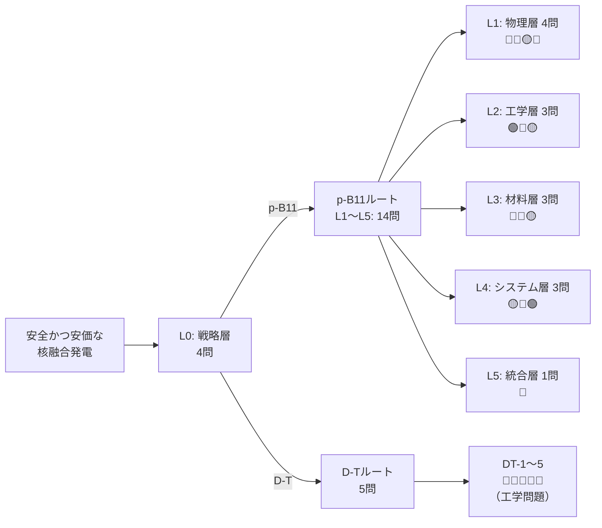

# p-B11核融合の電子問題 — 思考実験の最終結論

> **一言で:** 13のアプローチを全て検討した結果、αチャネリング（32年間未実証、成功確率15%）だけが残った。

---

## 1. 出発点

```
世界平和 → エネルギー不足が戦争の根 → 核融合 → p-B11が理想燃料
```

p + ¹¹B → 3α + 8.7 MeV。中性子ゼロ、放射性廃棄物ゼロ、燃料は水素とホウ素（安価・豊富）。
ただし物理的難易度は D-T の桁違いに上。**本当に可能なのか？**

素人エンジニアが Claude と要問フレームワーク（答えを出す価値のある本質的な問いに分解するアプローチ）で掘り下げた記録。

---

## 2. 要問ツリー（最終版）



```
合計23問: 🟢 2 / 🟡 7 / 🔴 14
p-B11ルート: 解決済み 2/18（タイミング同期、燃料供給のみ）
```

---

## 3. 最大の発見: Rider の 0.22 は古い

Rider（1995）が「p-B11 は P_fus/P_brem = 0.22 で原理的に不可能」としたのは旧データだった。

| 研究 | 年 | P_fus/P_brem（最適条件） |
|------|---|------------------------|
| Rider | 1995 | ~0.22（Ti=Te） |
| Nevins & Swain | 2000 | ~0.9〜1.05 |
| Sikora & Weller | 2016 | さらに~15%改善 |
| Putvinski et al. | 2019 | ~1.03（FRC最適条件） |
| arXiv:2405.13260 | 2024 | P_fus - P_brem = P_fus の 8.31% |
| arXiv:2601.00241 | 2026 | 300-400 keVで従来比~20%増 |

**最新: 最適温度（~300 keV）で P_fus/P_brem ≈ 1.0〜1.2。**
ただしマージンは数%。不純物・輸送損失を加えると容易に赤字。

---

## 4. 真の壁: P_ie（イオン-電子緩和）

P_brem問題が解消に近づいた今、**真のボトルネックはイオン-電子エネルギー緩和（P_ie）**に移った。

$$
P_{ie} \propto n_e \cdot Z^2 \cdot (T_i - T_e) / T_e^{3/2}
$$

- p-B11 では Z_B=5 のため、緩和率が D-T の **~25倍速い**
- Ti=300 keV, Te=30 keV 条件: **P_ie/P_fus ≈ 73.8**（独立検算済み）
- 最適Ti/Te条件でも **P_ie/P_fus ≈ 11〜19.5**（arXiv:2405.13260）
- イオンのエネルギーが電子に10〜20倍速く流出する → 外部加熱で補償が必要 → 再循環パワーが膨大

### 抜け道②「超短パルスで電子が追いつく前に燃やす」は計算で否定

```
τ_eq / τ_burn = 0.0038（密度非依存）

密度を上げても:
  n_e = 10²⁶ → τ_eq=1136ns, τ_burn=300,000ns → 比率 0.0038
  n_e = 10²⁸ → τ_eq=11.4ns, τ_burn=3,000ns  → 比率 0.0038
  n_e = 10³⁰ → τ_eq=0.11ns, τ_burn=30ns      → 比率 0.0038

両方 ∝ 1/n のため比率は不変。「一瞬のスキ」は存在しない。
```

---

## 5. 13のアプローチ全検討

### 古典的アプローチ（A〜E）

| ID | 方法 | 結果 |
|---|------|------|
| A | 空間的に電子を除去（磁場・ラーモア半径差） | ❌ デバイ遮蔽で不可能 |
| B | 時間的に逃げる（超短パルス） | ❌ τ_eq/τ_burn=0.0038、密度非依存 |
| C | 原子核に電子を吸収（電子捕獲） | ❌ 閾値不足（MeV級電子が必要） |
| D | エネルギー回収（直接変換） | 🟡 効率不足（P_ieは回収できない） |
| E | αチャネリング（波動経由バイパス） | 🔴 **唯一の生存経路だが32年間未実証** |

### 量子力学的な裏技（1〜8）

| # | 裏技 | 結果 | 根本的理由 |
|---|------|------|-----------|
| 1 | トンネル効果増強 | ❌ | Z₁Z₂=5は物理定数 |
| 2 | 電子遮蔽（スクリーニング） | ❌ | 3桁足りない（~100eV vs ~600keV） |
| 3 | ¹²C共鳴チューニング | — | 既に使用済み（ガモフピーク） |
| 4 | ミューオン触媒 | ❌ | D-Tでも赤字。p-B11ではさらに悪化 |
| 5 | パイクノ核融合 | ❌ | P_ieは密度非依存で消えない |
| 6 | コヒーレント核融合 | ❌ | 核波動関数が5桁離れて重ならない |
| 7 | フォトン支援トンネリング | ❌ | 世界最強レーザーの10⁵倍が必要 |
| 8 | 二段階触媒反応 | ❌ | そのような核反応経路は未知 |

**根本的理由:** 電子問題はクーロン衝突（古典電磁気学）の問題。Z=5は物理定数であり、量子効果で変えることは原理的にできない。

---

## 6. αチャネリング: 唯一の生存経路

### メカニズム

```
通常の減速:
  α粒子(2.9MeV) → 電子に衝突 → 電子加熱 → P_brem増加 → エネルギー損失

αチャネリング:
  α粒子(2.9MeV) → 波動を励起 → 波動がイオンを加速 → 核融合率向上
                                                      + α粒子は減速して排出
```

P_ie問題の緩和 + アッシュ蓄積（p+B→3α、1反応でα3個）の防止を同時に達成。

### 定量的効果（Ochs & Fisch 2024）

| チャネリング先 | ローソン積の緩和倍率 |
|--------------|-------------------|
| 熱的陽子に転送 | **2.6倍** |
| 高速陽子（反応ピーク近傍）に転送 | **6.9倍** |

### 理論の歴史（30年）

| 年 | 研究 | 内容 |
|---|------|------|
| 1992 | Fisch & Rax, PRL 69 | 概念提唱（トカマク向け） |
| 1997 | TFTR実験 | イオンバーンシュタイン波でα拡散経路を確認（間接的） |
| 2019 | TAE/Magee, Nature Physics | FRCでビーム駆動波→イオン加速を直接観測 |
| 2021 | Ochs & Fisch, PRL 127 | 非共鳴拡散による新理論 |
| 2024 | Ochs & Fisch, PoP 31 | p-B11ブレークイーブン要件の緩和 |
| 2025 | Ochs et al., PoP 32 | アッシュ蓄積防止・2領域プラズマ概念 |

### 実証状況

| 実証済み | 未実証 |
|---------|--------|
| ✅ イオンバーンシュタイン波の存在（1997） | ❌ α粒子→波動のエネルギー転送率 |
| ✅ ビーム駆動波→イオン加速（2019） | ❌ 波動→イオンの転送効率（要50%以上） |
| ✅ 理論の内部整合性（30年の査読通過） | ❌ p-B11条件での実験 |
| ✅ ARPA-Eの資金提供 | ❌ 2領域プラズマの実験実証 |

**32年間、直接的な実験実証は一度も成功していない。**

---

## 7. 他プロジェクトの比較

| プロジェクト | 方式 | 電子対策 | 達成温度 | 必要温度 | ギャップ | 見込み |
|------------|------|---------|---------|---------|---------|--------|
| **TAE** | FRC+NBI | 高β + 将来αチャネリング | ~7000万℃ | ~30億℃ | 43倍 | 最も先行。P_ie未解決 |
| **HB11** | レーザー駆動 | 制動放射を構造的に回避 | — | — | — | Q~10⁻⁴。商用は未知数 |
| **LINEA** | FRC+ミラー | ビーム駆動非熱核融合 | 理論段階 | — | — | P_ieに新理論。実験なし |
| **LPP** | DPF | 量子磁場効果（GT級） | ~20億℃ | ~30億℃ | 1.5倍 | 理論基盤に疑問 |
| **Marvel** | ナノ構造+fsレーザー | — | 実験段階 | — | — | ターゲット設計に注力 |

**共通点: どのプロジェクトもP_ie問題の決定的解決策を持っていない。**

---

## 8. D-Tルートとの比較: 物理の壁 vs 工学の谷

| | p-B11ルート | D-Tルート |
|---|---|---|
| 最大ボトルネック | **物理**: P_ie/P_fus ≈ 10〜20 | **工学**: 材料・トリチウム増殖 |
| ボトルネックの性質 | Z=5という物理定数に根ざす | 時間と金で解ける可能性が高い |
| 安全性 | ✅ 中性子ゼロ・廃棄物ゼロ | 🟡 中性子遮蔽・トリチウム管理 |
| 実証レベル | Q > 1 未達 | Q > 1 達成（NIF 2022） |
| 時間軸 | 2060年代以降？ | 2040〜2050年代？ |
| 失敗した場合 | 発電燃料として不可能 | 商用炉の時期が遅れる |

> **物理の壁は「原理的に可能かどうか不明」。工学の谷は「できるが時間がかかる」。**
> D-Tの工学問題は「試験施設を建てて、照射して、データを取る」という予測可能なプロセスで解ける。

---

## 9. 最終判定

### p-B11核融合の成功確率

| シナリオ | 確率 | 帰結 |
|---------|------|------|
| αチャネリング効率 > 50% | **~15%** | p-B11に「狭い窓」。商用炉は2060年代以降 |
| αチャネリング効率 10-50% | **~25%** | ニッチ用途のみ（宇宙推進等） |
| αチャネリング効率 < 10% or 不可能 | **~60%** | **p-B11は発電燃料として終了** |

### この思考実験で分かったこと

1. **Riderの0.22は過去のもの。** 最新データでP_fus/P_brem ≈ 1.0〜1.2
2. **真の壁はP_bremではなくP_ie。** Z=5の物理定数に根ざし、13の方法で攻めても突破できない
3. **αチャネリングが唯一の生存経路。** 32年間未実証、理論は進展中
4. **D-Tルートの方が確実。** ただしp-B11の「中性子ゼロ」の価値は代替不可能
5. **不可能を証明すること自体に価値がある。** p-B11の限界を正直に探索した

### 次のマイルストーン

TAE（Da Vinci）またはプリンストンによる**ビーム駆動波→イオンエネルギー転送の定量測定**。
この結果が出るまで、p-B11は「可能かもしれないし、不可能かもしれない」状態が続く。

---

## 10. 参考文献

### ベースライン更新（P_fus/P_brem）

| 文献 | 年 | 内容 |
|------|---|------|
| Rider, PoP 2, 1853 | 1995 | 旧ベースライン P_fus/P_brem ≈ 0.22 |
| Nevins & Swain, NF 40, 865 | 2000 | 新断面積データで ~0.9〜1.05 |
| Sikora & Weller, J. Fusion Energy 35, 538 | 2016 | 精密断面積測定（精度3.5%） |
| Putvinski et al., NF 59, 076018 | 2019 | FRC最適条件で ~1.03 |
| arXiv:2405.13260 | 2024 | 非平衡Ti/Te、最新断面積 |
| arXiv:2601.00241 | 2026 | 更新断面積、α運動効果 |

### αチャネリング

| 文献 | 年 | 内容 |
|------|---|------|
| Fisch & Rax, PRL 69, 612 | 1992 | αチャネリングの提唱 |
| Ochs & Fisch, PRL 127, 025003 | 2021 | 非共鳴拡散によるαチャネリング |
| Ochs et al., PRE 106, 055215 | 2022 | ハイブリッド高速+熱陽子方式 |
| Ochs & Fisch, PoP 31, 012503 | 2024 | p-B11ブレークイーブン要件緩和 |
| Ochs, Kolmes & Fisch, PoP 32, 052506 | 2025 | アッシュ蓄積防止・2領域プラズマ |
| Magee et al., Nature Physics 15, 281 | 2019 | FRCでビーム駆動波→イオン加速 |

### 電子問題・P_ie

| 文献 | 年 | 内容 |
|------|---|------|
| Rider, PoP 4, 1039 | 1997 | 非マクスウェル分布維持の不可能性の主張 |
| Rostoker et al., Science 278, 1419 | 1997 | FRC中の大ラーモア半径効果 |
| NRL Plasma Formulary | — | τ_eq計算の基礎公式 |

### Opus白紙分析

| 文献 | 内容 |
|------|------|
| [Phase 1: D-T結論](https://github.com/GoodRelax/pb11-fusion/blob/main/fusion/nuclear-fusion-analysis.md) | 燃料未指定・先入観なしで分析 → D-Tが最適 |
| [Phase 2: p-B11深掘り](https://github.com/GoodRelax/pb11-fusion/blob/main/fusion/p-b11-analysis.md) | p-B11の電子問題を独立検証 |

---

## リポジトリ

- **GitHub:** [GoodRelax/pb11-fusion](https://github.com/GoodRelax/pb11-fusion)
- **要問ツリー全体:** [overview.md](https://github.com/GoodRelax/pb11-fusion/blob/main/yomons/overview.md)
- **インタラクティブHTML:** [simulations/](https://goodrelax.github.io/pb11-fusion/simulations/)

---

_分析: Claude Sonnet 4.6 → Opus 4.6 + 素人エンジニア_
_知識カットオフ: 2025年5月_
_最終更新: 2026-04-05_
