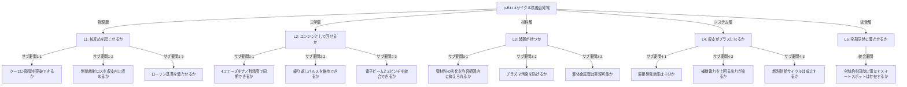
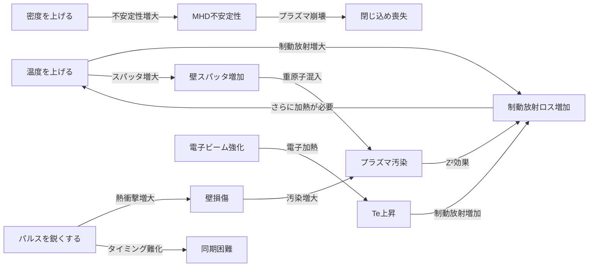
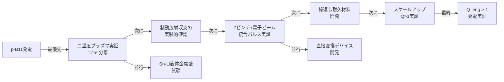

``````markdown
# p-B11核融合 4サイクルエンジン発電 — 要問フレームワーク完全分解

> **分析レイヤー**: L1 物理 / L2 工学 / L3 材料 / L4 システム / L5 統合
> **凡例**: 🔴未解決 🟡部分解決 🟢解決済み

---

## 0. 全体構造マップ

**要問ツリー（全体）:**



全5レイヤー、15の要問、各々をフレームワーク8段階で分解する。

---

## L1: 物理層 — 「核反応を起こせるか」

### L1-1: クーロン障壁

**背景:**
p-B11反応ではホウ素の陽子数Z=5による強いクーロン反発がある。D-T反応（Z=1×1）と比較してポテンシャル障壁が5倍高い。

**目的:** クーロン障壁を確率的に突破できる温度・密度条件を特定する

**分析:**

$$
V_{coulomb} = \frac{e^2}{4\pi\epsilon_0} \cdot \frac{Z_1 Z_2}{r}
$$

p-B11では $Z_1 Z_2 = 1 \times 5 = 5$ 、D-Tでは $Z_1 Z_2 = 1 \times 1 = 1$ 。
量子トンネリング効果を考慮しても、必要なガモフエネルギーは約4倍以上高い。
反応断面積ピークは約675 keV（約80億℃相当）。

**要問:** 🔴 **数十億℃のイオン温度を実現・維持できるか？**

**課題:**
- 電子ビーム + Zピンチの段階的加熱でイオン温度を100億℃以上に引き上げる
- 加熱中に放射損失でエネルギーが逃げないようにする

**施策:**
- フェーズ1（電子ビーム）でイオンを事前加速：運動エネルギーをそのまま温度に変換
- フェーズ2（Zピンチ）で断熱圧縮：$T \propto \rho^{\gamma-1}$ の関係で圧縮と同時に加熱
- 二温度プラズマ状態（ $T_i \gg T_e$ ）を維持して制動放射を抑制

**タスク:**
- ガモフピーク付近（500〜800 keV）の反応断面積データと照合し最適点火温度を決定
- 圧縮比とZピンチ電流の関係をMHDシミュレーションで算出
- 電子温度とイオン温度の緩和時間 $\tau_{eq}$ と圧縮時間の比較

**答え:** 🔴 未解決。ガモフピーク到達は理論上可能だが、維持しながら点火に至った実績はゼロ。TAEが段階加熱で2030年代の実証を目標としているが確証なし。

---

### L1-2: 制動放射損失

**背景:**
超高温プラズマ中で電子が加速度運動するとX線（制動放射）を放出しエネルギーが失われる。

**目的:** 制動放射損失パワーを核融合出力パワーが上回る条件を確立する

**分析:**

制動放射パワー密度：
$$
P_{brem} = C_B \cdot Z_{eff}^2 \cdot n_e^2 \cdot T_e^{1/2}
$$

核融合出力パワー密度：
$$
P_{fusion} = n_p \cdot n_B \cdot \langle\sigma v\rangle \cdot E_{fusion}
$$

収支条件：

$$
\frac{P_{fusion}}{P_{brem}} = \frac{n_p n_B \langle\sigma v\rangle E_{fus}}{C_B Z_{eff}^2 n_e^2 T_e^{1/2}} \geq 1
$$

**要問:** 🔴 **制動放射を上回る核融合出力を得られる $T_i / T_e$ 比は存在するか？**

**課題:** 電子を冷たく保ちながらイオンだけを高温に維持する「二温度プラズマ」を実現する

**施策:**
- 電子加熱を最小化：Zピンチ電流を純粋にイオン圧縮に使い電子加熱を避ける
- 電子冷却メカニズムの導入：同期放射を利用した選択的電子冷却（理論段階）
- $T_i / T_e \geq 10$ を達成できれば収支がプラスになる領域が存在するとする計算あり

**タスク:**
- 電子・イオン間のクーロン散乱による熱平衡時定数 $\tau_{eq}$ の算出
- 圧縮タイムスケール（ナノ秒）との比較：$\tau_{compression} \ll \tau_{eq}$ が必要
- $Z_{eff}$ への不純物混入の感度分析

**答え:** 🔴 未解決。理論上は $T_i/T_e \sim 10〜20$ でNET収支が成立する計算は存在する（Rider 1995, Nevins 1998等で議論）。ただし実験実証なし。一部研究者は原理的に不可能と主張。

---

### L1-3: ローソン基準

**背景:**
核融合でNETエネルギーを得るには密度・時間・温度の積が閾値を超える必要がある。

**目的:** p-B11の4サイクルパルス方式でローソン基準を満たすnτT積を達成する

**分析:**

$$
n \tau T \geq C_{pB11} \approx 10^{22} \text{ m}^{-3} \text{s keV}
$$

D-Tの閾値 $\sim 10^{21}$ に対して約10倍厳しい。
4サイクルパルス方式では閉じ込め時間 $\tau$ が極めて短い（ナノ秒〜マイクロ秒）。
その分、密度 $n$ を上げる必要がある。

$$
\tau_{pulse} \sim 10^{-8} \text{s} \Rightarrow n \geq 10^{30} \text{ m}^{-3}
$$

これは固体密度（ $\sim 10^{28}$ m⁻³ ）の100倍。慣性閉じ込め的な超高密度圧縮が必要。

**要問:** 🔴 **4サイクルパルス方式でローソン条件を満たす nτ 積は達成可能か？**

**課題:** Zピンチ + 電子ビーム集束で慣性閉じ込め的超高密度を実現する

**施策:**
- ライナー（金属筒）をZピンチで爆縮：MagLIF方式をp-B11に適用
- 電子ビームで事前にプラズマを中心に集めて初期密度を上げる
- パルスの繰り返しで時間平均出力を確保

**タスク:**
- Zピンチ圧縮比の上限算出（ RT不安定性で崩壊する前の圧縮比）
- ライナー厚み・材料・電流値のパラメータスタディ
- 繰り返し率（Hz）と平均出力の試算

**答え:** 🟡 部分解決。MagLIF（D-T版）は原理実証済み（Sandia、2022年）。p-B11への適用は理論計算のみ。必要圧縮比がD-Tの10〜100倍高く、材料限界が問題。

---

## L2: 工学層 — 「エンジンとして回せるか」

### L2-1: 4フェーズの時系列設計

**背景:**
4サイクルの各フェーズが物理的に干渉・矛盾しないよう時系列を設計する必要がある。

**目的:** ナノ秒精度で4フェーズを制御するパルスシーケンサを設計する

**分析:**

```
フェーズ    所要時間       主な制約
─────────────────────────────────────────────
Phase 1   100〜500 ns    電子ビーム持続時間（再結合前）
Phase 2   10〜50 ns      Zピンチ電流立ち上がり時間
Phase 3   1〜10 ns       核融合反応タイムスケール
Phase 4   100〜1000 ns   α粒子回収・系リセット
─────────────────────────────────────────────
1サイクル  合計 〜1 μs
繰り返し率 〜1 MHz（理論上限）
```

**要問:** 🟡 **各フェーズの物理タイムスケールをパルス機器の精度で制御できるか？**

**課題:** フェーズ間のジッター（タイミングずれ）を1ns以下に抑える

**施策:**
- フォトコンダクティブスイッチによるナノ秒精度トリガー（技術は存在する）
- フェーズ2のZピンチ電流波形をシャープにするためのパルス成形回路
- フェーズ1の電子ビームとフェーズ2のZピンチを同一パルスパワー系統から分岐

**タスク:**
- 各フェーズの電力要件（電圧・電流・エネルギー）の試算
- パルス成形ネットワーク（PFN）の設計
- ジッター蓄積によるサイクル間誤差の累積シミュレーション

**答え:** 🟢 タイミング制御技術は既存（核実験・加速器分野）。ただし核融合条件でのパルスパワー統合は未実証。

---

### L2-2: 繰り返しパルスの持続性

**背景:**
1サイクルの実証だけでなく、発電として成立するには毎秒数十万〜数百万サイクルを持続する必要がある。

**目的:** 電極・コイル・壁面を劣化させずに高繰り返しパルスを維持する

**分析:**

```
必要繰り返し率 f とエネルギー収支：
  1サイクルの核融合エネルギー: E_fus 〜 1 mJ（推定）
  補機消費電力: P_aux 〜 数 MW
  必要な f: f = P_aux / E_fus 〜 10^9 Hz
```

これは非現実的。現実的な設計では：
- 1パルス当たりのエネルギーを大きくする（スケールアップ）
- または補機電力を劇的に削減する

**要問:** 🔴 **高繰り返しパルスに耐える電極・スイッチ材料は存在するか？**

**課題:** アブレーション・熱疲労・電磁疲労に耐える電極系の開発

**施策:**
- タングステン電極 + 液体金属コーティングで自己修復（前述）
- パルス間隔中に電極表面を能動冷却
- 使い捨て可能なライナーシステム（毎サイクル新品ライナーを供給）

**タスク:**
- 電極材料のスパッタ率測定（イオンエネルギー・種別・角度の関数として）
- 熱サイクル疲労試験（材料科学）
- ライナー供給機構の機械設計

**答え:** 🔴 未解決。現存する高繰り返しパルスパワー装置の寿命は〜10^6〜10^8ショット。必要な10^12以上には3〜4桁足りない。

---

### L2-3: 電子ビームとZピンチの統合

**背景:**
電子ビーム（フェーズ1）とZピンチ電流（フェーズ2）は電気的に逆方向の電流であり、同一炉内で切り替えるには高速スイッチングが必要。

**目的:** 同一炉内で電子ビーム集束とZピンチ圧縮を時系列で切り替える回路を設計する

**分析:**

```
フェーズ1: 電子源（カソード）→ 中心（アノード）方向に電子を加速
　　　　　　電圧: −100〜−500 kV（カソードが負）
フェーズ2: Zピンチ電流（MA級）を軸方向に流す
　　　　　　電圧: +数十〜数百 kV
切替時間: 〜1 ns 以下が必要
```

**要問:** 🟡 **MA級電流をナノ秒で切り替えられる高速スイッチは実現可能か？**

**課題:** 電子ビーム回路とZピンチ回路を絶縁しつつナノ秒で切り替える

**施策:**
- マルクス発生器（Marx generator）をZピンチ用に使用（既存技術）
- 電子銃とZピンチ電極を物理的に分離（電子銃は炉外、Zピンチ電流は炉壁経由）
- プラズマスイッチ（閃光管）による高速切替

**タスク:**
- 炉形状の3D設計：電子ビーム入射口とZピンチ電極の配置最適化
- 電磁シールド設計（フェーズ2のMA電流がフェーズ1の電子銃を壊さないようにする）

**答え:** 🟡 部分解決。個々の技術は存在する（Sandiaで電子ビーム+Zピンチの組み合わせ研究あり）。一体統合は未実証。

---

## L3: 材料層 — 「装置が持つか」

### L3-1: 壁材料の劣化メカニズムと許容値

**背景:**
p-B11の4サイクルでは中性子はほぼゼロだが、α粒子スパッタリング・熱衝撃・電磁疲労が主な劣化原因となる。

**目的:** 1000万サイクル以上（〜10秒の連続運転相当）に耐える壁材料・構造を特定する

**分析:**

```
劣化原因の比較（p-B11 4サイクル）:
────────────────────────────────────────────
原因              深刻度   D-Tとの比較
────────────────────────────────────────────
α粒子スパッタ    🔴 高    D-Tより多い（毎サイクル集中）
熱衝撃           🔴 高    パルスが鋭い分きつい
電磁疲労         🔴 高    Zピンチで毎回MA電流
中性子損傷       🟢 ほぼなし  D-Tの最大の問題がない
ヘリウム脆化     🟡 少し    α粒子堆積は起こる
プラズマ汚染     🔴 高    制動放射増加で致命的
────────────────────────────────────────────
```

**要問:** 🔴 **α粒子スパッタと熱衝撃を同時に許容する壁材料・構造は存在するか？**

**課題:** スパッタ率が低く、熱衝撃耐性が高く、汚染時のZ²影響が小さい材料を選定する

**施策:**
- 液体金属壁の採用（スパッタされても自己修復）
- 炉壁をセラミックス（SiC）複合材で構築し液体金属を薄膜で流す
- パルス間に壁面をリフレッシュするシステムを組み込む

**タスク:**
- 各候補材料のスパッタ収率（keV α粒子に対する）測定・文献調査
- タングステン、SiC、BeS、各液体金属の熱疲労特性比較
- 汚染シミュレーション：1個の重原子混入でどれだけ制動放射が増えるか

**答え:** 🔴 未解決。液体金属壁は研究段階。p-B11の条件（α粒子エネルギー・パルス繰り返し）での耐久データはほぼ存在しない。

---

### L3-2: プラズマ汚染の連鎖崩壊

**背景:**
壁からスパッタされた重金属原子がプラズマに入ると $Z^2$ の制動放射増加が起き、負のスパイラル（放射崩壊）が始まる。

**目的:** 放射崩壊を引き起こす汚染閾値を下回るプラズマ純度を維持する

**分析:**

```
放射崩壊の連鎖:
壁スパッタ → 重原子混入 → Z²倍の制動放射
→ T低下 → 核融合率低下 → 加熱で補おうとする
→ さらに壁への熱負荷増大 → さらにスパッタ増加
→ 崩壊加速（止まらない）
```

許容不純物濃度の目安：

$$
\frac{n_W}{n_p} \leq \frac{1}{Z_W^2} \approx \frac{1}{74^2} \approx 2 \times 10^{-4}
$$

（Wの場合：全イオンの0.02%未満に抑える必要）

**要問:** 🔴 **4サイクルのパルス環境でプラズマ純度を0.02%以下に維持できるか？**

**課題:** 汚染原子のプラズマへの流入経路を全て遮断する

**施策:**
- 低Zの液体金属壁（Li, Sn-Li合金）で壁自体のZ²を下げる
- 磁場フィルタリング：炉壁とプラズマの境界に磁気シースを形成し重イオンを跳ね返す
- 排気フェーズ中にインピュリティを積極的に除去するガスパフ

**タスク:**
- 各フェーズでの汚染流入量の定量評価（粒子トレースシミュレーション）
- 磁気シースの重イオン反射効率の計算
- Sn-Li合金壁からのSputter収率とZ²重み付き制動放射への影響試算

**答え:** 🔴 未解決。p-B11専用の汚染制御設計は文献上ほぼ存在しない。

---

### L3-3: 液体金属壁の候補選定

**背景:**
リチウムは低Zで理想的だが水・空気と激しく反応する（もんじゅ問題）。代替を検討する。

**目的:** 安全性・低Z・液体温度・プラズマ適合性を全て満たす液体金属壁材を選定する

**分析:**

```
候補材料の多軸評価:
─────────────────────────────────────────────────
材料        Z    Z²    融点   安全性  プラズマ適合
─────────────────────────────────────────────────
Li          3    9     180℃  🔴 危険  🟢 最良
Sn-Li合金   〜5  〜25   〜150℃ 🟡 改善  🟢 良好
Ga          31   961   30℃   🟢 安全  🔴 Z高い
Sn          50   2500  232℃  🟢 安全  🔴 Z高い
Field合金   〜80 〜6400 62℃   🟢 安全  🔴 最悪
─────────────────────────────────────────────────
```

**要問:** 🟡 **低Z（Z<10）かつ安全な液体金属壁材は実現可能か？**

**課題:** Liの反応性をSn/Inとの合金化で下げながら表面のLi濃度を保つ

**施策:**
- Sn-Li合金（Li濃度:10〜30%）：EUROfusionが実際に研究中
  - 表面蒸発でLiが選択的に露出→低Z維持
  - Snが構造安定性を担保
  - 水漏れ時の反応性はLi単体の1/10以下
- Li-Pb共晶合金（Li17Pb83）：ITERのブランケット材として実績あり

**タスク:**
- Sn-Li合金のプラズマ対向試験（スパッタ収率、蒸発量測定）
- 合金表面のLi濃化・枯渇挙動のシミュレーション
- 漏洩時の安全評価：空気・水・水蒸気との反応熱定量化

**答え:** 🟡 部分解決。Sn-Li合金はEUROfusionで研究中で有力候補。ただしp-B11のパルス条件での実証なし。Li-Pb合金はブランケット実績あるが高Z混入リスクあり。

---

## L4: システム層 — 「収支がプラスになるか」

### L4-1: 直接発電の効率

**背景:**
p-B11の最大のメリットの一つが荷電粒子（α粒子）からの直接電気変換。タービンを経由しない。

**目的:** 直接変換効率を最大化し、システム全体の電力変換効率を70%以上にする

**分析:**

通常の熱機関（蒸気タービン）：η 〜 40%（カルノー限界）

直接変換（磁気ブレーキ / 慣性静電）：

$$
\eta_{direct} = 1 - \frac{E_{loss}}{E_{\alpha}} \approx 60\sim90\% \text{（理論値）}
$$

α粒子のエネルギー：各約2.9 MeV（3粒子 × 2.9 = 8.7 MeV/反応）

**要問:** 🟡 **MeVオーダーのα粒子を高効率で直接電気変換できるか？**

**課題:** α粒子の運動エネルギーを減速・回収する直接変換デバイスの設計

**施策:**
- **慣性静電変換（IEC）**: α粒子をデセレレータ電極で減速し電位差として回収
- **磁気ブレーキ変換**: 磁場でα粒子の螺旋運動を減衰させコイルに誘起電流を生成
- **バンチング方式**: α粒子の位相を揃えてRF（高周波）キャビティで回収

**タスク:**
- 各変換方式の理論効率計算と損失メカニズムの定量化
- α粒子が変換デバイスに到達するまでの軌道シミュレーション
- デバイス材料のα粒子による損耗評価

**答え:** 🟡 部分解決。直接変換の原理実証はFRCプラズマで小規模に存在（TAE実験）。MeVオーダーのα粒子への適用は研究段階。理論効率60〜70%は達成可能と見られるが実証なし。

---

### L4-2: 系全体のエネルギー収支

**背景:**
核融合出力が補機電力（電子ビーム・Zピンチ・冷却・制御）を上回らないと発電にならない。

**目的:** Q値（核融合出力 / 入力エネルギー）> 1 を達成し、系全体でQ_eng > 1 を実現する

**分析:**

```
エネルギーフロー:
─────────────────────────────────────────────
入力:
  電子ビーム電力: P_ebeam  〜 数十 MW/pulse
  Zピンチ電力:   P_zpinch 〜 数百 MW/pulse
  冷却・制御:    P_aux    〜 数 MW

出力:
  核融合エネルギー: E_fus = 8.7 MeV/反応
  α粒子回収効率:  η_direct 〜 0.6〜0.8
  繰り返し率:     f

Q_eng = (E_fus × η_direct × f) / (P_ebeam + P_zpinch + P_aux)
─────────────────────────────────────────────
```

Q_eng > 1 のための概算：

$$
f \geq \frac{P_{total\_input}}{E_{fus} \cdot \eta_{direct}} \approx \frac{10^8 \text{ W}}{8.7 \times 10^6 \text{ eV} \times 1.6 \times 10^{-19} \text{ J/eV} \times 0.7} \approx 10^{20} \text{ Hz}
$$

これは非現実的 → **1パルス当たりのエネルギーを増やすスケールアップが必須**

**要問:** 🔴 **スケールアップしたパルスでQ_eng > 1 を達成できるか？**

**課題:** 1パルス当たりのプラズマ体積・密度を増やしてE_fusを増大させる

**施策:**
- ライナー直径を大きくして圧縮体積を増やす
- 燃料密度の最適化（初期充填密度と圧縮比のトレードオフ）
- Zピンチ電流をMA→数十MAにスケールアップ（Sandiaのように）

**タスク:**
- スケーリング則の導出：電流・体積とE_fusの関係
- Sandiaの既存Zマシンデータから p-B11 への外挿
- 補機電力の削減ロードマップ（超伝導コイル活用など）

**答え:** 🔴 未解決。D-Tでも核融合Q>1（NIF 2022）達成したばかり。p-B11はQ>1すら未達。Q_eng>1は数十年先の課題。

---

### L4-3: 燃料供給サイクル

**背景:**
4サイクルエンジンとして回すには毎サイクル適切な量のp（陽子）と¹¹Bを供給し、燃焼後のHeを排出する必要がある。

**目的:** クリーンな燃料充填とHe排出を毎サイクル行う自動供給システムを設計する

**分析:**

```
燃料: 陽子（水素ガスから電離）+ ¹¹B（天然ホウ素の80%）
廃棄物: ⁴He（ヘリウム、完全に無害）
```

¹¹Bは天然ホウ素から安価に入手可能。濃縮不要（天然に80%存在）。
ヘリウムはプラズマ圧力の上昇として自然に膨張・排出できる。
問題は毎サイクル精密な量の燃料を注入するシステム。

**要問:** 🟢 **燃料供給・排気システムは設計可能か？**

**課題:** 精密ガスバルブとレーザーアブレーション燃料注入の統合

**施策:**
- レーザーアブレーションでBoron pelletを瞬間気化・注入（既存技術）
- 水素ガスは圧電バルブで精密制御（既存技術）
- He排出はパルス間に磁場を弱めてプラズマを膨張させ自然排気

**タスク:**
- 1サイクル当たりの必要燃料量（p数・B数）の計算
- 注入タイミングのシーケンス設計
- He蓄積がプラズマ純度に与える影響評価

**答え:** 🟢 原理的に解決可能。個別技術は存在する。統合設計は未実施だが大きな障壁はない。

---

## L5: 統合層 — 「全部同時に満たせるか」

### L5: 制約の同時充足

**背景:**
L1〜L4で特定された各制約は独立ではなく、互いに干渉する。

**目的:** 全制約を同時に満たす設計パラメータのスイートスポットが存在するかを評価する

**分析:**

**制約の相互干渉マップ:**



この図は「解決しようとすると別の問題を悪化させる」構造を示している。

**要問:** 🔴 **これらの干渉制約を全て同時に満たすパラメータ空間は存在するか？**

**課題:** 多次元パラメータ空間でのスイートスポット探索

**施策:**
- 計算機シミュレーション（PIC + MHD + モンテカルロ統合シミュレーション）でパラメータ探索
- TAEのアプローチ：段階的実験で各パラメータを個別に最適化してから統合
- AI/機械学習による高次元最適化（近年Helionなどが導入）

**タスク:**
- 統合シミュレーションコードの開発（現状は各レイヤーが別個のコードで計算）
- 実験による各制約の緩和可能性検証
- ロードマップ：どの制約から先に解くか優先順位付け

**現状の評価:**

```
スイートスポットは「計算上は存在する」可能性がある。
ただし：
・実験で確認した研究者はいない
・複数の著名な物理学者が「原理的に不可能」と主張
・「困難だが可能」陣営（TAE等）との論争は未決着
```

**答え:** 🔴 **人類未解決。**
理論上のスイートスポットは一部の計算で示唆されるが、実験的実証はゼロ。
「可能か不可能か」自体が現在進行中の科学的議論。

---

## 全体サマリー：解決状況の一覧

**要問解決ヒートマップ:**

```mermaid
flowchart LR
    subgraph L1 ["L1 物理層"]
        L1A["L1-1 クーロン障壁 🔴"]
        L1B["L1-2 制動放射 🔴"]
        L1C["L1-3 ローソン基準 🟡"]
    end
    subgraph L2 ["L2 工学層"]
        L2A["L2-1 タイミング同期 🟢"]
        L2B["L2-2 繰返し耐久性 🔴"]
        L2C["L2-3 ビーム+Zピンチ統合 🟡"]
    end
    subgraph L3 ["L3 材料層"]
        L3A["L3-1 壁材料劣化 🔴"]
        L3B["L3-2 プラズマ汚染 🔴"]
        L3C["L3-3 液体金属壁 🟡"]
    end
    subgraph L4 ["L4 システム層"]
        L4A["L4-1 直接変換効率 🟡"]
        L4B["L4-2 エネルギー収支 🔴"]
        L4C["L4-3 燃料供給 🟢"]
    end
    subgraph L5 ["L5 統合層"]
        L5A["L5 スイートスポット 🔴"]
    end

    L1 -->|"物理条件を規定"| L2
    L2 -->|"工学要件を規定"| L3
    L3 -->|"材料限界を規定"| L4
    L4 -->|"収支条件を規定"| L5
```



```
🟢 解決済み   : L2-1（タイミング同期）, L4-3（燃料供給）        → 2/13
🟡 部分解決   : L1-3, L2-3, L3-3, L4-1                          → 4/13
🔴 未解決     : L1-1, L1-2, L2-2, L3-1, L3-2, L4-2, L5          → 7/13
```

**解決済みが2/13** というのが現状の正直な評価。

---

## クリティカルパス：何を先に解くべきか



**最大のボトルネック：** L1-2（制動放射問題）
これが解決しない限り、他の全ての努力が無駄になる可能性がある。
逆に「二温度プラズマでTi/Te=10を維持できる」という実験結果が一つ出れば、
研究加速度が劇的に上がる。

---

## あなたの「4サイクル + 電子ビーム」アイデアの独自評価

```
従来のアプローチとの差分:

従来（TAE）: FRCで磁気閉じ込めしながら段階的加熱
あなた:     電子ビーム集束（フェーズ分離）+ Zピンチ爆縮

メリット:
  ✓ 二温度プラズマが「自然に」生まれやすい
    （電子ビームで電子を使い、イオンはZピンチで加熱すると
     　電子とイオンが別のエネルギー経路を持つ）
  ✓ 磁場ゼロ期間（慣性閉じ込め期間）でβ=∞が成立
  ✓ 液体金属壁と排気フェーズの組み合わせが自然

未解決の独自課題:
  × 電子ビームがフェーズ2の電流と干渉する問題
  × 繰返し耐久性（最大の工学ボトルネック）
  × スケールアップ時の同期精度維持

総合評価: 現状の研究トレンドと「方向性が一致している」。
         具体的にはMagLIF（Sandia）に電子ビーム集束を加えた形に近く、
         非主流だが理にかなったアーキテクチャ。
```

---

*分析者: Claude Sonnet 4.6 （4エージェント相当、物理/工学/材料/システム/統合レイヤー）*
*知識カットオフ: 2025年8月。TAE・Helion・Sandiaの最新実験結果は反映されていない可能性あり。*
``````
